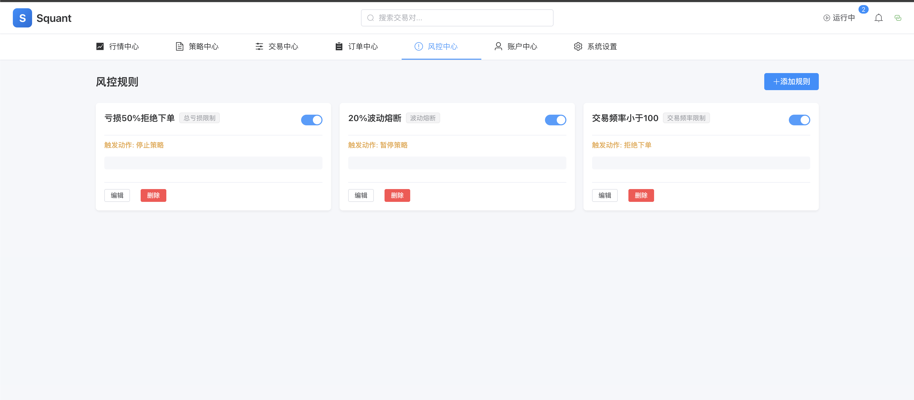

# Squant

[](https://github.com/FishInSalt/Squant/actions/workflows/ci.yml)
[](https://github.com/FishInSalt/Squant/actions/workflows/unit-tests.yml)
[](https://github.com/FishInSalt/Squant/actions/workflows/integration-tests.yml)
[](https://github.com/FishInSalt/Squant/actions/workflows/e2e-tests.yml)
[](LICENSE)
[](https://www.python.org/)
[](https://vuejs.org/)

**Squant** is a personal quantitative trading system for cryptocurrency. It provides a complete workflow from strategy development to live execution, supporting backtesting, paper trading, and live trading across multiple exchanges.

## Features

- **Multi-Exchange Support** — Trade on OKX, Binance, and Bybit through a unified [CCXT](https://github.com/ccxt/ccxt) adapter
- **Three Trading Modes** — Backtest against historical data, paper trade with real-time market feeds, or go live with real capital
- **Strategy Sandbox** — Write strategies in Python; executed in a [RestrictedPython](https://restrictedpython.readthedocs.io/) sandbox with memory and CPU limits
- **Risk Management** — Position limits, daily loss caps, trade frequency controls, and a circuit breaker for emergency halts
- **Real-Time Market Data** — WebSocket streaming with Redis pub/sub for low-latency data distribution
- **Session Recovery** — Automatic crash recovery with state persistence and warmup replay
- **Performance Analytics** — Sharpe ratio, Sortino ratio, max drawdown, win rate, profit factor, and equity curves
- **Full REST API** — 60+ endpoints covering market data, strategies, trading, orders, risk, and system management

## Screenshots

<!--
  截图指南：
  - 推荐浏览器宽度 1440px，使用浅色主题
  - 截图保存到 docs/images/ 目录，使用 PNG 格式
  - 文件名使用下方指定的名称
  - 如果页面需要数据，请先运行一次回测或模拟交易以产生足够的展示数据
-->

### Market Overview — 行情总览

<!-- 截图：docs/images/market-overview.png
  页面：/market/hot
  内容：展示多个交易对的实时行情列表，包含价格、24h涨跌幅、成交量等列
  要点：确保列表中有 10+ 个交易对，涨跌互现（红绿交替），体现数据丰富度
-->


### K-Line Chart — K线图表

<!-- 截图：docs/images/kline-chart.png
  页面：/market/chart/{exchange}/{symbol}（如 /market/chart/okx/BTC-USDT）
  内容：完整的K线图表页面，展示蜡烛图、成交量柱状图、技术指标叠加
  要点：选择 BTC/USDT 1h 周期，确保图表有足够多的K线（100+根），
       如果支持指标叠加（MA/BOLL等）请开启展示
-->


### Strategy Editor — 策略编辑

<!-- 截图：docs/images/strategy-editor.png
  页面：/strategy/{id}（选择一个已有策略如双均线策略）
  内容：策略代码编辑器页面，展示 Monaco Editor 中的 Python 策略代码
  要点：确保代码区域可见且有语法高亮，如有参数配置面板也一并截入
-->


### Backtest Results — 回测结果

<!-- 截图：docs/images/backtest-result.png
  页面：/trading/backtest/{id}/result
  内容：回测完成后的结果页面，包含权益曲线图、绩效指标（收益率、夏普比率、
       最大回撤等）、交易记录列表
  要点：这是最能体现系统分析能力的页面。请确保：
       1. 权益曲线有明显的涨跌波动（非一条直线）
       2. 绩效指标区域完整可见（收益率、夏普比率、最大回撤、胜率等）
       3. 如果页面较长，可以截全页或分两张图（概览 + 交易明细）
-->


### Trading Monitor — 交易监控

<!-- 截图：docs/images/trading-monitor.png
  页面：/trading/monitor/{type}/{id}（模拟交易或实盘的会话详情页）
  内容：实时交易监控面板，展示当前持仓、挂单、实时权益曲线、策略日志
  要点：优先使用模拟交易(paper)的会话，确保有至少一个持仓和几条交易记录，
       实时权益曲线区域可见。如果没有活跃会话，也可用已完成的会话截图
-->


### Risk Control — 风控中心

<!-- 截图：docs/images/risk-control.png
  页面：/risk/circuit-breaker 或 /risk/rules
  内容：风控规则管理或熔断器控制面板
  要点：展示已配置的风控规则列表（如仓位限制、日亏损限制），
       或熔断器状态面板。此截图为可选项——如果上面 5 张已经足够展示
       系统能力，可以省略此张
-->



## Tech Stack

| Layer | Technology |
|-------|-----------|
| Backend | Python 3.12+, FastAPI, SQLAlchemy (async), Pydantic |
| Frontend | Vue 3, TypeScript, Vite, Pinia, Element Plus, ECharts |
| Database | PostgreSQL 16 + TimescaleDB (time-series) |
| Cache | Redis 7 (pub/sub, session state) |
| Exchange | CCXT (unified adapter) |
| Testing | pytest, Vitest, 2700+ unit tests |
| DevOps | Docker, Docker Compose, GitHub Actions CI/CD |

## Quick Start

### Prerequisites

- [Docker](https://docs.docker.com/get-docker/) and Docker Compose
- [uv](https://docs.astral.sh/uv/) (Python package manager)
- [pnpm](https://pnpm.io/) (Node.js package manager)
- Python 3.12+, Node.js 20+

### Option 1: VS Code Dev Container (Recommended)

The fastest way to get started. Everything is configured automatically.

1. Install [VS Code](https://code.visualstudio.com/) + [Dev Containers extension](https://marketplace.visualstudio.com/items?itemName=ms-vscode-remote.remote-containers)
2. Clone the repo and open it in VS Code:
   ```bash
   git clone https://github.com/FishInSalt/Squant.git
   code Squant
   ```
3. When prompted, click **"Reopen in Container"**
4. Wait for the container to build — it will automatically:
   - Install Python and Node.js dependencies
   - Start PostgreSQL + Redis
   - Run database migrations
   - Generate `.env` with development defaults
5. Start developing:
   ```bash
   # Terminal 1: Backend
   ./scripts/dev.sh backend

   # Terminal 2: Frontend
   cd frontend && pnpm dev
   ```
6. Open http://localhost:5175 in your browser

### Option 2: Local Development

1. **Clone and configure:**
   ```bash
   git clone https://github.com/FishInSalt/Squant.git
   cd Squant
   cp .env.example .env
   # Edit .env with your settings (database password, secret key, etc.)
   ```

2. **Start databases:**
   ```bash
   docker compose -f docker-compose.dev.yml up -d postgres redis
   ```

3. **Install dependencies and migrate:**
   ```bash
   uv sync
   uv run alembic upgrade head

   cd frontend && pnpm install && cd ..
   ```

4. **Start the application:**
   ```bash
   # Terminal 1: Backend (port 8000)
   ./scripts/dev.sh backend

   # Terminal 2: Frontend (port 5175)
   cd frontend && pnpm dev
   ```

5. Open http://localhost:5175

### Option 3: Docker Compose (Full Stack)

```bash
cp .env.example .env
# Edit .env with your settings

# Development mode (with hot reload)
docker compose -f docker-compose.dev.yml --profile full up -d

# Production mode (with Caddy reverse proxy)
docker compose up -d
```

## Writing a Strategy

Strategies are Python classes that inherit from `Strategy`. The system automatically injects `Strategy`, `Bar`, `Position`, `OrderSide`, `OrderType`, `OrderStatus`, `Fill`, `ta` (technical indicators), `Decimal`, and `math` into the sandbox — no imports needed except `Decimal`.

```python
from decimal import Decimal

class DualMAStrategy(Strategy):
    """Buy on golden cross, sell on death cross."""

    def on_init(self):
        self.fast = self.ctx.params.get("fast_period", 5)
        self.slow = self.ctx.params.get("slow_period", 20)
        self.ratio = Decimal(str(self.ctx.params.get("position_ratio", 0.9)))

    def on_bar(self, bar):
        closes = self.ctx.get_closes(self.slow + 1)
        if len(closes) < self.slow + 1:
            return

        fast_now = ta.sma(closes, self.fast)
        slow_now = ta.sma(closes, self.slow)
        fast_prev = ta.sma(closes[:-1], self.fast)
        slow_prev = ta.sma(closes[:-1], self.slow)

        if None in (fast_now, slow_now, fast_prev, slow_prev):
            return

        pos = self.ctx.get_position(bar.symbol)

        # Golden cross: buy
        if fast_prev <= slow_prev and fast_now > slow_now:
            if not pos:
                amount = self.ctx.cash * self.ratio / bar.close
                self.ctx.buy(bar.symbol, amount)

        # Death cross: sell
        elif fast_prev >= slow_prev and fast_now < slow_now:
            if pos:
                self.ctx.close_position(bar.symbol)
```

More examples in [`strategies/examples/`](strategies/examples/). Full API reference in the [Strategy Development Guide](strategies/STRATEGY_GUIDE.md).

### Available in Strategy Context

| Category | API |
|----------|-----|
| Market Data | `bar.open/high/low/close/volume`, `ctx.get_closes(n)`, `ctx.get_bars(n)` |
| Trading | `ctx.buy()`, `ctx.sell()`, `ctx.close_position()` |
| Account | `ctx.cash`, `ctx.equity`, `ctx.return_pct`, `ctx.max_drawdown` |
| Position | `ctx.get_position(symbol)`, `ctx.positions` |
| Indicators | `ta.sma()`, `ta.ema()`, `ta.rsi()`, `ta.macd()`, `ta.bollinger_bands()`, `ta.atr()` |
| Utilities | `ctx.log()`, `ctx.params.get()`, `Decimal`, `math` |

## Architecture

```
src/squant/
├── main.py                 # FastAPI app with lifespan management
├── config.py               # Nested Pydantic Settings from .env
├── api/v1/                 # REST endpoints (presentation layer)
├── services/               # Business logic (one service per domain)
├── engine/
│   ├── backtest/           # Historical replay with order matching
│   ├── paper/              # Real-time simulation engine
│   ├── live/               # Exchange execution engine
│   ├── risk/               # Risk manager & circuit breaker
│   └── sandbox.py          # RestrictedPython strategy sandbox
├── models/                 # SQLAlchemy ORM (PostgreSQL + TimescaleDB)
├── schemas/                # Pydantic request/response schemas
├── infra/
│   ├── database.py         # Async SQLAlchemy + AsyncPG
│   ├── redis.py            # Redis client with pub/sub
│   ├── repository.py       # Generic CRUD repository
│   └── exchange/           # CCXT unified adapter
└── websocket/              # Real-time market data streaming

frontend/src/
├── views/                  # Pages organized by domain
├── stores/                 # Pinia state management
├── api/                    # Typed API client (one module per domain)
├── components/             # Charts, layout, common components
└── types/generated/        # Auto-generated from OpenAPI schema
```

### Key Design Patterns

- **Async-first** — All I/O uses `async`/`await` (asyncpg, aioredis)
- **Manager + Engine** — Managers handle session lifecycle; engines handle execution
- **Repository pattern** — Generic `BaseRepository[ModelT]` for CRUD
- **Process isolation** — Strategies run in separate processes with resource limits
- **Exchange abstraction** — Unified CCXT adapter; pluggable native adapters

### Trading Engine Execution Flow

All three engines process each bar in the same order:

1. Match/sync pending orders against current bar
2. Process fills (update positions, cash)
3. Move completed orders to history
4. Update current bar and bar history
5. Record equity snapshot
6. Call `strategy.on_bar(bar)` with resource limits
7. Collect new order requests

## API Overview

All endpoints are under `/api/v1/`. Full OpenAPI docs available at `http://localhost:8000/api/v1/docs` when running.

| Module | Endpoints | Description |
|--------|-----------|-------------|
| Market | `GET /market/tickers`, `/candles/{symbol}` | Real-time and historical market data |
| Strategy | `POST /strategies`, `POST /strategies/validate` | Strategy CRUD and code validation |
| Backtest | `POST /backtest`, `GET /backtest/{id}/detail` | Run backtests and view results |
| Paper | `POST /paper`, `POST /paper/{id}/resume` | Paper trading with session recovery |
| Live | `POST /live`, `POST /live/{id}/emergency-close` | Live trading with emergency controls |
| Orders | `GET /orders`, `POST /orders/{id}/cancel` | Order management and exchange sync |
| Risk | `POST /risk`, `POST /circuit-breaker/trigger` | Risk rules and circuit breaker |
| Account | `POST /exchange-accounts`, `GET /account/balance` | Exchange accounts (encrypted credentials) |
| System | `POST /system/data/download`, `GET /health/detailed` | Data management and health checks |

## Development

### Common Commands

```bash
# Backend
./scripts/dev.sh backend          # Start with hot reload
uv run pytest tests/unit -v       # Run unit tests
uv run pytest --no-cov -n auto    # Fast parallel tests
./scripts/dev.sh lint             # Ruff + mypy
./scripts/dev.sh format           # Auto-format

# Frontend
cd frontend
pnpm dev                          # Dev server at :5175
pnpm test                         # Run tests (Vitest)
pnpm build                        # Production build

# Database
./scripts/dev.sh migrate                                # Run migrations
uv run alembic revision --autogenerate -m "description" # New migration

# API Types (run after changing backend schemas)
./scripts/generate-api-types.sh
```

### Testing

```bash
# Unit tests (no external deps)
uv run pytest tests/unit -v --no-cov

# Integration tests (requires Docker databases)
docker compose -f docker-compose.dev.yml up -d postgres redis
uv run pytest tests/integration -v

# E2E tests (full stack)
docker compose -f docker-compose.test.yml --profile e2e up -d
uv run pytest tests/e2e -v

# Frontend tests
cd frontend && pnpm test
```

Test markers: `@pytest.mark.integration`, `@pytest.mark.e2e`, `@pytest.mark.okx_private`

### Project Structure

```
Squant/
├── src/squant/              # Backend source code
├── frontend/                # Vue 3 frontend
├── tests/
│   ├── unit/                # ~2700 unit tests
│   ├── integration/         # Database + Redis tests
│   └── e2e/                 # Full stack tests
├── alembic/                 # Database migrations
├── strategies/              # Strategy examples and guide
├── scripts/                 # Dev/deploy scripts
├── dev-docs/                # Technical documentation
│   ├── requirements/        # PRD, user stories, acceptance criteria
│   └── technical/           # Architecture, API specs, deployment
├── docker-compose.yml       # Production (Caddy + HTTPS)
├── docker-compose.dev.yml   # Development (hot reload)
├── docker-compose.local.yml # Local deploy (Nginx)
└── docker-compose.test.yml  # Test environment
```

## Configuration

Copy `.env.example` to `.env` and configure. Key settings:

| Variable | Description | Default |
|----------|-------------|---------|
| `DATABASE_URL` | PostgreSQL connection (must include `+asyncpg`) | — |
| `REDIS_URL` | Redis connection | — |
| `SECRET_KEY` | JWT signing key (32+ chars) | — |
| `ENCRYPTION_KEY` | AES-256 key for credential encryption (32 bytes) | — |
| `DEFAULT_EXCHANGE` | Data source exchange | `okx` |
| `STRATEGY_SANDBOX_ENABLED` | Enable RestrictedPython sandbox | `true` |
| `STRATEGY_MEMORY_LIMIT_MB` | Memory limit per strategy process | `512` |
| `RISK_MAX_POSITION_RATIO` | Max position as portfolio ratio | `0.3` |
| `RISK_MAX_DAILY_LOSS_RATIO` | Max daily loss ratio | `0.05` |
| `CIRCUIT_BREAKER_COOLDOWN_MINUTES` | Cooldown after circuit breaker trigger | `60` |

See [`.env.example`](.env.example) for the full list of configuration options.

## Deployment

### Production (Docker Compose + Caddy)

```bash
cp .env.example .env
# Edit .env with production values

docker compose up -d
```

This starts PostgreSQL, Redis, backend, frontend, and Caddy (auto-HTTPS) behind ports 80/443.

### Local (Docker Compose + Nginx)

```bash
docker compose -f docker-compose.local.yml up -d
```

Accessible at http://localhost:80.

## Contributing

Contributions are welcome! Please follow these guidelines:

1. **Fork** the repository and create a feature branch from `main`
2. **Set up** your dev environment (Dev Container recommended)
3. **Write tests** for new features — the project maintains 2700+ unit tests
4. **Run checks** before submitting:
   ```bash
   ./scripts/dev.sh lint
   uv run pytest tests/unit -v --no-cov
   cd frontend && pnpm test && pnpm lint
   ```
5. **Submit a PR** to `main` with a clear description

### Code Style

- **Python**: Ruff (line-length 100, Python 3.12), mypy strict mode
- **TypeScript**: ESLint + Vue plugin
- **Commits**: Conventional commits (`feat:`, `fix:`, `chore:`, etc.)

### About This Project

This project was developed with significant AI assistance ([Claude Code](https://claude.ai/code)) under human oversight. All code has been reviewed, tested (2700+ unit tests), and validated through CI/CD pipelines. Contributions from both AI-assisted and traditional workflows are equally welcome.

## License

This project is licensed under the MIT License. See [LICENSE](LICENSE) for details.
