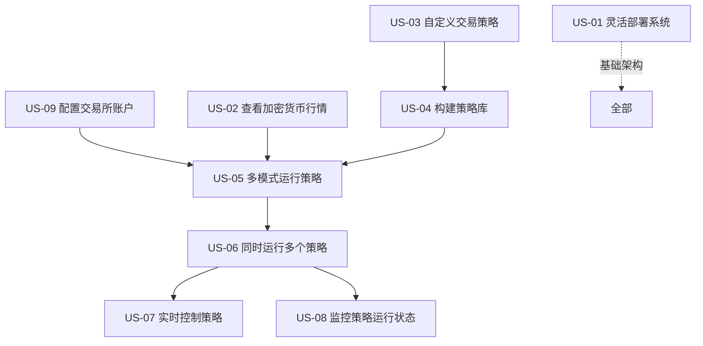

# 用户故事文档

---

## 1. 文档信息

| 项目 | 内容 |
|------|------|
| 文档版本 | v1.0 |
| 创建日期 | 2026-01-24 |
| 关联PRD | PRD-QuantTradingSystem.md |
| 关联用户画像 | 用户画像.md |

---

## 2. 用户故事格式说明

每个用户故事遵循以下格式：
- **格式**：As a [user], I want [goal], so that [benefit]
- **中文**：作为[用户角色]，我想要[实现什么]，以便[获得什么价值]
- **编号规则**：US（User Story）+ 数字，对应PRD中的FR编号

---

## 3. 用户故事清单

### US-01：灵活部署系统

**对应需求：** FR-01 系统运行方式

**用户故事：**
> 作为个人投资者，我想要系统能够部署在本地或云服务器，并通过浏览器访问，以便我可以灵活选择部署环境并降低使用门槛。

**详细描述：**
- 用户希望根据自己的实际情况（如网络环境、硬件资源）选择部署方式
- Web浏览器作为主要交互方式，降低客户端软件的安装和维护成本
- 未来如果有需要，也可以开发客户端应用

---

### US-02：查看加密货币行情

**对应需求：** FR-02 行情看板

**用户故事：**
> 作为个人投资者，我想要在行情看板上查看热门和自选的加密货币行情，以便快速了解市场动态并做出交易决策。

**详细描述：**
- 热门币种：用户能够快速看到市场主流加密货币的行情
- 自选币种：用户可以添加自己关注的交易对，方便跟踪
- 行情数据包括价格、涨跌幅等基础信息（具体字段待实现确认）

---

### US-03：自定义交易策略

**对应需求：** FR-03 自定义策略模板

**用户故事：**
> 作为个人投资者，我想要一个清晰的策略模板和接口规范，以便我能够快速编写和实现自己的交易策略。

**详细描述：**
- 系统提供标准的策略模板代码
- 模板定义了必要的接口方法（具体方法待实现确认）
- 用户只需实现特定的接口逻辑，无需关注底层系统实现

---

### US-04：构建策略库

**对应需求：** FR-04 策略库构建

**用户故事：**
> 作为个人投资者，我想要通过上传策略文件的方式将策略保存到策略库，以便我能够统一管理和复用已开发好的策略。

**详细描述：**
- 用户可以上传策略文件到系统
- 系统对策略文件进行校验
- 只有校验通过的策略才能进入策略库
- 校验的具体标准待实现时确定（如语法检查、接口完整性检查等）

---

### US-05：多模式运行策略

**对应需求：** FR-05 策略运行模式

**用户故事：**
> 作为个人投资者，我想要对策略进行回测、模拟运行和实盘运行，以便我能够全面验证策略的有效性后再投入实盘。

**详细描述：**
- **回测模式**：使用历史数据验证策略表现，评估策略的收益和风险
- **模拟运行**：使用实时行情进行模拟交易，但不产生真实资金流动
- **实盘运行**：连接真实交易所，执行真实交易

---

### US-06：同时运行多个策略

**对应需求：** FR-06 多策略并发运行

**用户故事：**
> 作为个人投资者，我想要同时运行多个策略，以便我能够对比不同策略的表现并分散投资风险。

**详细描述：**
- 系统支持多个策略同时运行
- 每个策略运行在独立的进程中
- 策略之间相互隔离，互不影响

---

### US-07：实时控制策略

**对应需求：** FR-07 策略实时控制

**用户故事：**
> 作为个人投资者，我想要随时停止运行中的策略并退出相关交易，以便在发现异常或市场变化时及时止损。

**详细描述：**
- 用户可以随时发起停止指令
- 策略进程能够响应停止指令并优雅退出
- 策略产生的持仓和挂单需要相应处理（具体逻辑待实现确认）

---

### US-08：监控策略运行状态

**对应需求：** FR-08 策略运行监控

**用户故事：**
> 作为个人投资者，我想要查看运行中策略的实时状态，包括交易对行情和交易订单，以便及时了解策略的表现和持仓情况。

**详细描述：**
- 用户可以查看每个运行策略的监控页面
- 监控内容至少包括：
  - 关联交易对的实时行情
  - 已产生的交易订单
- 具体监控字段和指标待实现时确定

---

### US-09：配置交易所账户

**对应需求：** FR-09 交易所账户配置

**用户故事：**
> 作为个人投资者，我想要在账户页面配置交易所的API Key，以便系统能够代表我执行交易操作。

**详细描述：**
- 系统提供账户配置页面
- 用户可以输入交易所的API Key信息
- 配置后系统可以调用交易所API进行行情获取和订单操作
- API Key的安全存储方式待实现时确定

---

## 4. 用户故事优先级

| 优先级 | 用户故事 | 编号 | 理由 |
|--------|----------|------|------|
| **P0 (MVP核心)** | 配置交易所账户 | US-09 | 实盘交易的基础 |
| **P0 (MVP核心)** | 查看加密货币行情 | US-02 | 系统的基础功能，为策略提供数据 |
| **P0 (MVP核心)** | 自定义交易策略 | US-03 | 策略开发的基础 |
| **P0 (MVP核心)** | 构建策略库 | US-04 | 策略管理的基础 |
| **P0 (MVP核心)** | 多模式运行策略 | US-05 | 策略验证的核心功能 |
| **P1 (重要)** | 灵活部署系统 | US-01 | 部署方式的选择是基础架构决策 |
| **P1 (重要)** | 同时运行多个策略 | US-06 | 提升系统效率，但初期可先支持单策略 |
| **P1 (重要)** | 实时控制策略 | US-07 | 实盘交易的必要功能 |
| **P2 (优化)** | 监控策略运行状态 | US-08 | 增强用户体验，但可以通过日志替代 |

---

## 5. 用户故事依赖关系

**依赖说明：**
- US-01（部署）是基础架构，影响所有功能
- US-02（行情）和US-09（账户配置）是US-05（策略运行）的前提
- US-03（策略模板）→ US-04（策略库）→ US-05（策略运行）是线性依赖
- US-06（多策略）、US-07（控制）、US-08（监控）都依赖US-05（策略运行）

---

## 6. 附录

### 6.1 待实现确认的内容

以下内容在用户故事中已标注，需要在实现阶段进一步确认：

| 用户故事 | 待确认内容 |
|----------|------------|
| US-02 | 行情数据的具体字段（价格、成交量、涨跌幅等） |
| US-03 | 策略模板接口的具体方法定义 |
| US-04 | 策略校验的具体标准（语法检查、接口完整性检查等） |
| US-05 | 三种运行模式的具体实现逻辑差异 |
| US-07 | 策略停止后"退出交易"的具体逻辑（平仓？撤单？） |
| US-08 | 监控页面的详细字段和指标 |
| US-09 | API Key的安全存储方式 |

### 6.2 用户故事验收标准

每个用户故事的详细验收标准请参考《验收标准.md》文档。
